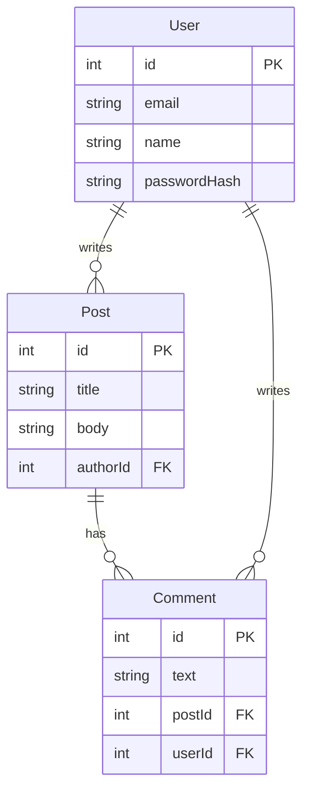

## Database Schema



## API Routes

| Method | Path | Handler | Description |
|--------|------|---------|-------------|
| GET | /api/users | userController.list | List all users |
| POST | /api/users | userController.create | Create a new user |
| GET | /api/posts | postController.list | List all posts |
| POST | /api/posts | postController.create | Create a new post |
| GET | /api/posts/:id | postController.get | Get a single post |
| DELETE | /api/posts/:id | postController.delete | Delete a post |

## Directory Structure

```
myapp/
├── src/
│   ├── controllers/
│   │   ├── userController.ts
│   │   └── postController.ts
│   ├── models/
│   │   ├── User.ts
│   │   └── Post.ts
│   └── routes/
│       └── index.ts
└── package.json
```

## Request Flows

| Feature | Frontend Component | Endpoint | DB Tables |
|---------|--------------------|----------|-----------|
| List Posts | PostList | GET /api/posts | Post, User |
| Create Post | PostForm | POST /api/posts | Post |
| View Post | PostDetail | GET /api/posts/:id | Post, Comment |
| Register User | RegisterForm | POST /api/users | User |
